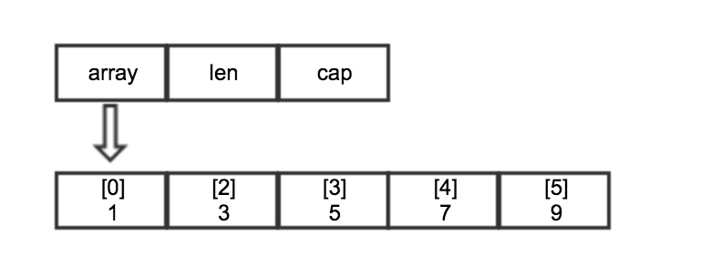

## golang 切片的内部实现

### 1. 内部实现
Go中的切片是一种数据结构，切片可以按照自己的方式增长或者减短，切片是一个很小的结构，在我的64位电脑上只有24字节，切片有三个字段如下：

```go
type slice struct {
	array unsafe.Pointer
	len   int
	cap   int
}
```



你可以编辑以下代码来查看slice的结构:

```go
s := []string{"w", "a", "g"}
d := (*reflect.SliceHeader)(unsafe.Pointer(&s))
fmt.Println(*d)
```
第一个字段array指向底层数组的一个指针，len记录切片访问元素的个数(可访问长度) cap允许元素增长的个数(切片容量)

### 2. 创建切片

Go语言中提供make来创建切片，slice的make源码实现如下：

```go
func makeslice(et *_type, len, cap int) slice {
	// 根据类型大小获取可比较的最大长度
	maxElements := maxSliceCap(et.size)
	if len < 0 || uintptr(len) > maxElements {
		panic(errorString("makeslice: len out of range"))
	}
	// 比较容量和长度 比较容量和最大值
	if cap < len || uintptr(cap) > maxElements {
		panic(errorString("makeslice: cap out of range"))
	}

	// 申请一块内存
	p := mallocgc(et.size*uintptr(cap), et, true)
	// 将指针长度容量赋值并返回新切片(这里的长度只是和cap作比较后放入切片结构中)
	return slice{p, len, cap}
}
```


第一个参数是数据的类型，第二个参数长度，第三个参数是容量，如果只指定长度那么切片的容量和长度相等，也可以分别指定长度和容量。(容量小于长度的切片会在编译时报错)

### 3. 空切片

#### 1、Go中切片的零值是nil 创建一个为nil 的字符串切片

    var s []string
    
为nil切片的表示


#### 2、创建一个不为nil的空切片

    var s = []string{} // 或
    var s = make([]string, 0)
    
不为nil的空切片没有分配任何存储空间，它的内存模型如下：


这里需要说明一点，为nil的切片和不为nil的空切片调用append和len还有cap效果都是一样的。

### 4. 切片增长

切片相对于数组而言，是可以按需增长，需要对切片扩容需要使用append 源码如下：

```go
//     s := l1
//     n := len(s) + len(l2)
//     // Compare as uint so growslice can panic on overflow.
//     if uint(n) > uint(cap(s)) {
//       s = growslice(s, n)
//     }
//     s = s[:n]
//     memmove(&s[len(l1)], &l2[0], len(l2)*sizeof(T))
func growslice(et *_type, old slice, cap int) slice {
	if raceenabled {
		callerpc := getcallerpc(unsafe.Pointer(&et))
		racereadrangepc(old.array, uintptr(old.len*int(et.size)), callerpc, funcPC(growslice))
	}
	if msanenabled {
		msanread(old.array, uintptr(old.len*int(et.size)))
	}

	if et.size == 0 {
		if cap < old.cap {
			panic(errorString("growslice: cap out of range"))
		}
		// 创建一个不为nil的切片
		return slice{unsafe.Pointer(&zerobase), old.len, cap}
	}

	newcap := old.cap
	doublecap := newcap + newcap
	if cap > doublecap {
		newcap = cap
	} else {
		if old.len < 1024 {
			newcap = doublecap
		} else {
			for newcap < cap {
				newcap += newcap / 4
			}
		}
	}

	var lenmem, newlenmem, capmem uintptr
	const ptrSize = unsafe.Sizeof((*byte)(nil))
	switch et.size {
	case 1:
		lenmem = uintptr(old.len)
		newlenmem = uintptr(cap)
		capmem = roundupsize(uintptr(newcap))
		newcap = int(capmem)
	case ptrSize:
		lenmem = uintptr(old.len) * ptrSize
		newlenmem = uintptr(cap) * ptrSize
		capmem = roundupsize(uintptr(newcap) * ptrSize)
		newcap = int(capmem / ptrSize)
	default:
		lenmem = uintptr(old.len) * et.size
		newlenmem = uintptr(cap) * et.size
		capmem = roundupsize(uintptr(newcap) * et.size)
		newcap = int(capmem / et.size)
	}

	if cap < old.cap || uintptr(newcap) > maxSliceCap(et.size) {
		panic(errorString("growslice: cap out of range"))
	}

	var p unsafe.Pointer
	if et.kind&kindNoPointers != 0 {
		p = mallocgc(capmem, nil, false)
		memmove(p, old.array, lenmem)
		memclrNoHeapPointers(add(p, newlenmem), capmem-newlenmem)
	} else {
		p = mallocgc(capmem, et, true)
		if !writeBarrier.enabled {
			memmove(p, old.array, lenmem)
		} else {
			for i := uintptr(0); i < lenmem; i += et.size {
				typedmemmove(et, add(p, i), add(old.array, i))
			}
		}
	}

	return slice{p, old.len, newcap}
}
```

切片在append的时候如果有额外的容量可用，append将可用的元素合并到切片的长度，然后对他进行赋值，如果没有可用的容量，append会创建新的底层数组，将现有的值复制到新的数组里再追加新的值。

copy切片的源码如下：

```go
func slicecopy(to, fm slice, width uintptr) int {
	if fm.len == 0 || to.len == 0 {
		return 0
	}

	n := fm.len
	if to.len < n {
		n = to.len
	}

	if width == 0 {
		return n
	}

	if raceenabled {
		callerpc := getcallerpc(unsafe.Pointer(&to))
		pc := funcPC(slicecopy)
		racewriterangepc(to.array, uintptr(n*int(width)), callerpc, pc)
		racereadrangepc(fm.array, uintptr(n*int(width)), callerpc, pc)
	}
	if msanenabled {
		msanwrite(to.array, uintptr(n*int(width)))
		msanread(fm.array, uintptr(n*int(width)))
	}

	size := uintptr(n) * width
	if size == 1 { 
		*(*byte)(to.array) = *(*byte)(fm.array) // known to be a byte pointer
	} else {
		memmove(to.array, fm.array, size)
	}
	return n
}
```

copy切片会把源切片值(第二个参数值)中的元素复制到目标切片(第一个参数值)中，并返回被复制的元素个数，copy 的两个类型必须一致，并且实际复制的数量等于实际较短切片长度。

    作者：诺唯
    链接：https://zhuanlan.zhihu.com/p/28399762
    著作权归作者所有。商业转载请联系作者获得授权，非商业转载请注明出处。


