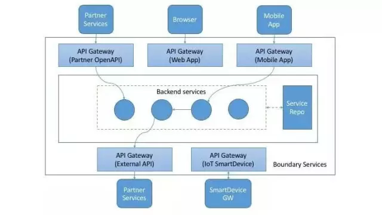
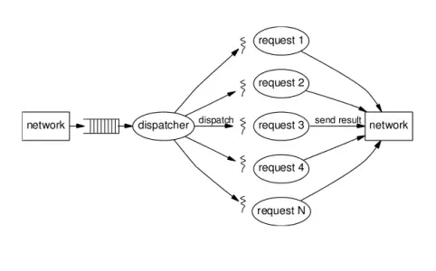
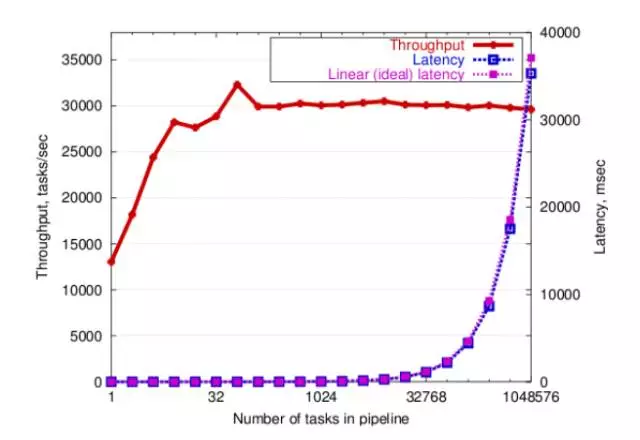
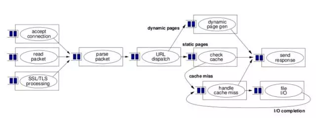
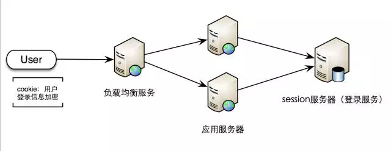
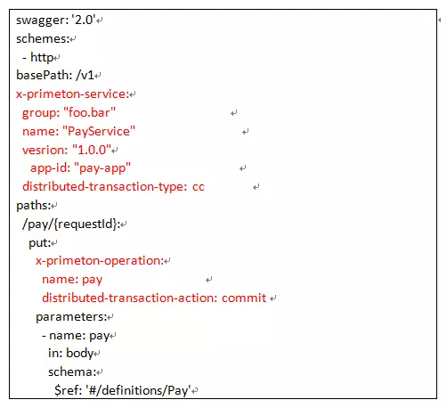

## 企业级API网关的设计

### 一、网关简介

#### 1.1  API网关背景介绍

API Gateway（APIGW / API 网关），顾名思义，是出现在系统边界上的一个面向API的、串行集中式的强管控服务，这里的边界是企业IT系统的边界，主要起到隔离外部访问与内部系统的作用。在微服务概念的流行之前，API网关的实体就已经诞生了，例如银行、证券等领域常见的前置机系统，它也是解决访问认证、报文转换、访问统计等问题的。

API网关的流行，源于近几年来，移动应用与企业间互联需求的兴起。移动应用、企业互联，使得后台服务支持的对象，从以前单一的Web应用，扩展到多种使用场景，且每种使用场景对后台服务的要求都不尽相同。这不仅增加了后台服务的响应量，还增加了后台服务的复杂性。随着微服务架构概念的提出，API网关成为了微服务架构的一个标配组件。

#### 1.2  网关的几种使用场景

我司王延炯博士的文章[《谈API网关的背景、架构以及落地方案》](http://mp.weixin.qq.com/s?__biz=MzI5MDEzMzg5Nw==&mid=2660393016&idx=1&sn=78596df454773ebfcbcdb62b56d5b6f1&scene=21#wechat_redirect)中，提到了网关的几种使用场景：

**1、面向Web App的网关**

这类场景，在物理形态上类似前后端分离，此时的Web App已经不是全功能的Web App，而是根据场景定制、场景化的App。

**2、面向MobileApp的网关**

这类场景，移动App是后端Service的使用者，此时的APIGW还需要承担一部分MDM（此处是指移动设备管理，不是主数据管理）的职能。

**3、面向PartnerOpenAPI的网关**

这类场景，主要为了满足业务形态对外开放，与企业外部合作伙伴建立生态圈，此时的API GW需要增加配额、流控、令牌等一系列安全管控功能。

**4、面向PartnerExternalAPI的网关**

这类场景，主要是为了满足企业自身业务的需要，实现对企业自有业务的映射。一个典型的例子就是使用「合作方账号登录」、「使用第三方支付平台支付」等等。此时的APIGW就需要在边界上，为企业内部Service 统一调用外部的API做统一的认证、授权、以及访问控制。

**5、面向IoTSmartDevice的网关**

这类场景主要在传统企业，尤其是工业企业，传感器、物理设备从工业控制协议向IP转换，导致物理链路上会存在一部分公网链路。此时的API GW所需要满足的「内外兼修」的双向数据流，设备一般通过一个「客户侧」的集中网关在和企业的接入网关进行通信。

在我们讲的微服务架构下的API网关，一般指的是前两种使用场景。即，主要是把企业内部的API能力，暴露给其他应用或合作伙伴使用。

### 二、网关的作用和价值

网关层作为客户端与服务端的一层挡板，主要起到了三大类作用：

- 第一类作用是隔离作用，作为企业系统边界，隔离外网系统与内网系统。
- 第二类作用是解耦作用，通过解耦，使得微服务系统的各方能够独立、自由、高效、灵活地调整，而不用担心给其他方面带来影响。
- 第三类作用是脚手架作用，提供了一个地点，方便通过扩展机制对请求进行一系列加工和处理。

#### 2.1  内外的隔离

企业为了保护内部系统的安全性，内网与外网都是隔离的，企业的服务应用都是运行在内网环境中，为了安全的考量，一般都不允许外部直接访问。API网关部署在防火墙外面，起到一层挡板作用，内部系统只接受API网关转发过来的请求。网关通过白名单或校验规则，对访问进行了初步的过滤。相比防火墙，这种软件实现的过滤规则，更加动态灵活。

#### 2.2  多方的解耦

在微服务架构下，整个环境包括服务的提供者、服务的消费者、服务运维人员、安全管理人员等，每个角色的职责和述求都不同。例如：服务消费者已经需要提出一些新的服务需求，以快速应对业务变化；服务提供者，作为业务服务的沉淀方，希望保持服务的通用性与稳定性，很难应对快速的变化。有了API网关这一层，可以很好的解耦各方的相互依赖关系，让各方更加专注自己的目标。

**1、解耦功能与非功能**

企业在把服务提供给外部访问时，除了实现业务逻辑功能外，还面临许多非功能性的要求。例如：需要防范黑客攻击，需要应对突发的访问量、需要确认用户的权限，需要对访问进行监控等。这些非功能逻辑，不能与业务逻辑的开发混在一起，需要有专业的人员甚至专业的团队来处理。

**2、解耦客户端与服务提供者**

客户端与服务提供者分属于不同的团队，工作性质要求也不相同。对于服务提供者来说，他主要的职责是对业务进行抽象，提供可复用的业务功能，他们需要对业务模型进行深入的思考和沉淀，不能轻易为了响应外部的需求而破坏业务模型的稳定性。而业务的快速变化，又要求企业快速提供接口来满足客户端需求。这就需要一个中间层，来对服务层的接口进行封装，以及时响应客户端的需求。

通过解耦，服务层可以使用统一的接口、协议和报文格式来暴露服务，而不必考虑客户端的多种形态。

**3、网关层是否需要实现服务的编排？**

在介绍API网关的一些文章中，提到了网关层的服务编排能力。从解耦的角度出发，服务的编排不适合在网关层进行。对服务的编排，其实是提供了一种业务能力，如果把服务的编排放在了网关层，实际上是把一部分业务能力放在了网关层，这样一来，服务层、网关层都有一些业务能力，造成团队职责的不清，也不利于业务能力的沉淀。

#### 2.3  插件的脚手架

网关层除了请求的路由、转发外，还需要负责安全、鉴权、限流、监控等。这些功能的实现方式，往往随着业务的变化不断调整。例如权限控制方面，早期可能只需要简单的用户+密码方式，后续用户量大了后，可能会使用高性能的第三方解决方案。又例如，针对不同的监控方案，需要记录不同的日志文件。

所以，这些能力不能一开始就固化在网关平台上，而应该是一种可配置的方式，便于修改和替换。这就要求网关层提供一套机制，可以很好地支持这种动态扩展。

#### 2.4  带来的好处

这里总结下网关的价值：

- 网关层对外部和内部进行了隔离，保障了后台服务的安全性。
- 对外访问控制由网络层面转换成了运维层面，减少变更的流程和错误成本
- 减少客户端与服务的耦合，服务可以独立发展。通过网关层来做映射。
- 通过网关层聚合，减少外部访问的频次，提升访问效率。
- 节约后端服务开发成本，减少上线风险。
- 为服务熔断，灰度发布，线上测试提供简单方案。
- 便于扩展。

### 三、企业级API网关需要具备的条件

#### 3.1  微服务架构下，企业API网关的定位

API网关作为对外提供服务的入口，就像企业服务的大门。一方面，要有足够的能力，应对大量的对外访问，另一方面，还要给对内的服务提供一定的安全保障。

除此之外，企业提供的API服务多种多样，API网关要能够对这些API的全生命周期进行便捷的管理，例如服务发布、调整、下架、计费、监控等。

#### 3.2  企业环境下，API网关需要考虑哪些要素

**1、安全性问题**

企业在把服务暴露给外部使用时，首先要确保服务使用的安全，防止外部的恶意访问对公司业务的影响，特别是涉及交易方面的服务，更是要全面考虑安全性。为确保安全，需要考虑在通讯链路的建立、通讯数据的加密、数据的完整性、不可抵赖性等方面。

**2、性能问题**

作为企业API的入口，所有的请求都会经过API网关进行转发，可想而知，对API网关的访问压力是巨大的，有的网站甚至达到每分钟上千万的访问量。特别是在一些互联网企业，海量的移动终端每时每刻都需要与后端的服务进行交互，如果不能保证网关的高性能，企业在网关层需要投入大量的设备和成本。曾在一家互联网公司发生过，由于网关性能问题，网关的机器数量，需要与后台服务器的数量保持同步增长。这种情况显然是企业服务忍受的。

**3、高可用问题**

API网关作为逻辑上的单点，一旦发生问题，将造成企业服务的不可用，对企业来说可能造成的致命的影响。计算短时间的不可用，也会给企业带来直接的经济损失。所以，如何保证API网关的7*24小时的稳定运行，网关的自动伸缩、API的热更新等问题，都是企业级的网关需要考虑的。

**4、扩展性问题**

前面说到，企业网关提供了一个脚手架，一些非功能性的问题，例如日志、安全、负载均衡策略、鉴权等。这些插件会随着企业业务规模等的变化进行不断的强化与调整。这就需要网关层提供这样一种机制，使得可以灵活地进行这些调整和变化，而不用频繁对网关层进行改动，确保网关层的稳定性。

**5、API高效运维的问题**

API在上线、发布过程中，都需要涉及到网关层的配合，例如，需要网关层知道API发布的地址，API的接口形式、报文格式，也需要网关层对后台API进行封装。在API调整后，需要作出相应的修改。所以，API网关设计时，需要明确网关层与服务层的职责切分与协作模式，使得API的管理、发布更加高效。

**6、API全生命周期管理的问题**

API服务的全生命周期，包括服务的开发、测试、上线发布；服务使用的申请、开通；服务分类分级别的管理、服务使用情况的监控、计费等等。

一个企业可能会暴露成百上千个API，日常也会经常进行API的发布、升级、改造、下架等操作。对不同的服务，不同的访问者，需要提供不同的服务访问策略。有的商业API公司，还需要对API的使用进行付费。所以，与API网关配套的，需要一套完善的自助系统，提供给服务的提供者、管理者、使用者，来对服务的发布、使用、和运营。

### 四、业界常用的API网关方案

业界API网关解决方案有很多，包括商业的、开源的。例如Tyk、Kong、api-umbrella、apiaxle、Netflix zuul、WSO2 API Manager、clydeio等。下面介绍三种常见的 API 网关方案。

#### 4.1  Nginx+ Lua

Nginx是由IgorSysoev为俄罗斯访问量第二的Rambler.ru站点开发的，一个高性能的HTTP和反向代理服务器。2012年，Nginx荣获年度云计算开发奖，并成长为世界第二大Web服务器。全世界流量最高的前1000名网站中，超过25%都使用Nginx来处理海量的互联网请求。

**Nginx基本功能：**

- 静态web资源服务器，能够缓存打开的文件描述符
- 支持http/imap/pop3/smtp的反向代理；支持缓存、负载均衡
- 支持fastcgi(fpm)
- 模块化，非DSO机制，支持过滤器zip压缩，SSI以及图像大小调整
- 支持SSL

**Nginx通过插件的扩展功能：**

- 基于名称和IP的虚拟主机
- 支持keepalive的保持机制
- 支持平滑升级
- 定制访问日志，支持使用日志缓存区提高日志存储性能
- 支持url rewrite
- 支持路径别名（root或alias指定）
- 支持基于IP以及用户的访问控制
- 支持传输速率限制，并发限制

**Nginx在性能和高可用性上的表现：**

Nginx性能极高，Nginx先天的事件驱动型设计、全异步的网络I/O处理机制、极少的进程间切换以及许多优化设计，都使得Nginx天生善于处理高并发压力下的互联网请求。Nginx的稳定性也在各大网站得到验证。官方提供的常用模块都非常稳定，每个worker进程相对独立，master进程在1个worker进程出错时可以快速“拉起”新的worker子进程提供服务。支持热部署，可以不停机更新配置文件、更新日志文件、更新服务器程序版本。

**Nginx的扩展性：**

Nginx的设计极具扩展性，它完全是由多个不同功能、不同层次、不同类型且耦合度极低的模块组成。因此，当对某一个模块修复Bug或进行升级时，可以专注于模块自身，无须在意其他。    

**Nginx的易用性：**

Nginx使用最自由的BSD许可协议，允许用户在自己的项目中直接使用或修改Nginx源码，有大量的插件可以利用。但是，Nginx模块需要用C开发，而且必须符合一系列复杂的规则。虽然通过第三方模块，可以支持Nginx与Perl、Lua等脚本语言集成工作，但对使用者的要求还是很高。

Nginx可以说是一款能够工业化API网关，在国内的很多互联网公司，例如阿里、新浪等都得到很好的应用。

#### 4.2  SpringCloud Zuul

Zuul Netflix公司开源的一个API网关组件。提供了认证&鉴权、限流、动态路由，监控，弹性，安全、负载均衡、协助单点压测、静态响应等边缘服务的框架。

**Zuul的基本功能：**

- 验证与安全保障: 识别面向各类资源的验证要求并拒绝那些与要求不符的请求。
- 审查与监控: 在边缘位置追踪有意义数据及统计结果，从而为我们带来准确的生产状态结论。
- 动态路由: 以动态方式根据需要将请求路由至不同后端集群处。
- 压力测试: 逐渐增加指向集群的负载流量，从而计算性能水平。
- 负载分配: 为每一种负载类型分配对应容量，并弃用超出限定值的请求。
- 静态响应处理: 在边缘位置直接建立部分响应，从而避免其流入内部集群。
- Netflix公司还利用Zuul的功能通过金丝雀版本实现精确路由与压力测试。
- 虽然提供的功能还算丰富，但都比较弱，很难满足高要求的场景。

**Zuul在性能和高可用性上的表现：**

Zuul处理每个请求的方式是针对每个请求是用一个线程来处理。通常情况下，为了提高性能，所有请求会被放到处理队列中，从线程池中选取空闲线程来处理该请求。2016年底，Netflix将它们的网关服务Zuul进行了升级，全新的Zuul 2将HTTP请求的处理方式从同步变成了异步，以提升其处理性能。除了Netflix公司，目前Zuul在企业中用的还比较少，性能和稳定性方面还有待进一步观察。

**Zuul的扩展性：**

从Zuul的架构图上可以看出，Zuul更像是一个过滤器框架，其自身的路由、日志、反向代理、ddos预防等功能都是通过过滤器实现的。提供了PRE、ROUTING、POST和ERROR四个扩展点，可以很容易的添加自定义的过滤器。  

**Zuul的易用性：**

Zuul的搭建非常简便，使用和配置也很简单。Zuul的开源社区比较活跃，一直在更新状态，但版本不算太稳定，在使用的过程中，还有一些坑要踩。例如重定向问题、异常处理问题，还没有解决的很好，需要自己重写一些filter。

如果从通盘考虑， 这种方案不是最佳方案。但如果自己的团队对整体技术设施把控有限，且团队规模不大，没有专门的网关开发人员的情况下，Zuul是一款快速上手的最佳方案。

#### 4.3  MashapeKong

Kong是Mashape提供的一款API管理软件，它本身是基于Ngnix+lua的，但比nginx提供了更简单的配置方式，数据采用了 ApacheCassandra/PostgreSQL存储，并且提供了一些优秀的插件，比如验证，日志，调用频次限制等。

Kong的一个非常诱人的地方就是提供了大量的插件来扩展应用，通过设置不同的插件可以为服务提供各种增强的功能。Kong默认插件插件包括：

- 身份认证：Kong提供了Basic Authentication、Key authentication、OAuth2.0authentication、HMAC authentication、JWT、LDAP authentication认证实现。
- 安全：ACL（访问控制）、CORS（跨域资源共享）、动态SSL、IP限制、爬虫检测实现。
- 流量控制：请求限流（基于请求计数限流）、上游响应限流（根据upstream响应计数限流）、请求大小限制。限流支持本地、Redis和集群限流模式。
- 分析监控：Galileo（记录请求和响应数据，实现API分析）、Datadog（记录API Metric如请求次数、请求大小、响应状态和延迟，可视化API Metric）、Runscope（记录请求和响应数据，实现API性能测试和监控）。
- 转换：请求转换、响应转换

Kong本身也是基于Nginx的，所以在性能和稳定性上都没有问题。Kong作为一款商业软件，在Nginx上做了很扩展工作，而且还有很多付费的商业插件。Kong本身也有付费的企业版，其中包括技术支持、使用培训服务以及API 分析插件。

从对上面三种方案的比较中可以看到，Spring Cloud Zuul非常适合创业初期的团队，快速搭建一个“基本可用”的API网关。Nginx适合有较强研发团队，自主开发企业自己的API网关。Kong适合于没有自身研发团队，但需要拥有企业级API网关能力的公司。

### 五、如何设计一个

好的企业级API网关产品

#### 5.1  功能上的考量

**API 生命周期管理功能：**

- 覆盖 API 的定义、测试、发布的整个生命周期管理，便捷的日常管理、版本管理，支持热升级和快速回滚。

**开发和使用支持功能：**

- 提供页面调试工具，自动生成 API 文档和 SDK，大大降低人力成本。

**安全防护功能：**

- API 请求到达网关需要经过严格的身份认证、权限认证，才能到达后端服务。支持算法签名，支持 SSL 加密。

**流量控制功能：**

- 可控制单位时间内 API 允许被调用次数。用来保护企业的后端服务，实现业务分级和用户分级。
- 支持对 API 流控，您可以根据 API 的重要程度来配置不同流控，从而保障重要业务的稳定运行；
- 支持用户、应用和例外流控，您可以根据用户的重要性来配置不同流控，从而可以保证大用户的权益；
- 流控粒度：分钟、小时、天。

**请求管理功能：**

- 可根据配置进行参数类型、参数值（范围、枚举、正则、Json Schema）的校验，减少后端对非法请求、无效请求的资源消耗和处理成本。
- 可以在 API 网关定义参数映射规则，网关通过映射规则将后端服务通过映射翻译成任何形式，以满足不同用户的不同需求，从而避免功能重复开发。

**监控告警功能：**

- 提供实时、可视化的 API 监控，包括：调用量、调用方式、响应时间、错误率，让您能够清楚的了解API 的运行状况和用户的行为习惯。
- 支持自定义报警规则，来针对异常情况进行报警，降低故障处理时间。
- 提供可订阅的数据分析报表和智能分析。

**API交易功能：**

- 提供API交易市场，计量计费、Quota 控制、运营售卖等需求。

#### 5.2 网关的高性能设计

传统的基于线程的并发模型（Thread-based concurrency），为每一个请求分配一个线程或进程。这种模型编程简单，可以将处理一个完整请求的代码编写在一个代码路径中。这种模型的弊端是，随着线程(进程)数的上升，操作系统在这些线程(进程)之间的频繁切换，将急剧降低系统的性能。

另一种更高效的并发模型是事件驱动的并发模型（Event-driven concurrency）。在这种模型中，每一个请求在系统被表示成一个有限状态机（FSM）。每一个FSM的状态表示请求的一系列的操作。服务器由一组线程/进程（一般是 one per CPU）循环处理各种来自队列的事件(Event)。

这种模型要求每一个状态的操作是短暂的并且是非阻塞的，所以 Event-driven concurrency模型一般都用了非阻塞的I/O接口（NIO）。

普元的产品中，为增加系统的吞吐量，是采用了基于事件的并发模型的SEDA的架构。SEDA架构的核心思想是：把一个请求处理过程分成几个Stage，每个Stage可由不同的handle进行处理，不同资源消耗的Stage使用不同数量的线程来处理，handle之间采用异步通讯的模式。

详细的SEDA架构介绍可以参见普元同事的一篇文章《选择SEDA作为云平台的基础消息处理架构》。

### 5.3  网关的高可用设计

保证高可用一般做法是解决单点故障给系统整体带来的影响。普元在产品设计时，为确保高可用，考虑了如下几点要素：

**1、无状态设计原则：** 网关层为保证高可以，易于伸缩，快速启动，需要设计成无状态的。用户的状态数据我们通常使用session对象来封装，网关层要设计成无状态的，也就是说，不能由网关来负责session的维护。那由谁来维护session相关的信息呢？我们是采用cookie+session服务器的方式；

- 用户在登录页完成登录操作后，服务器会生成一个登录session信息，保存起来，设置个失效时间，并设置到用户的cookie里
- 用户后续的每次请求里会带着这个cookie信息，服务端会对这个cookie信息进行校验，通过了就认为是合法用户，执行请求操作

**2、优雅下线原则：** 当网关发现某一个节点不可用时（例如请求响应时间超过阀值），不是直接断开与此节点的连接，而是先把此节点标记为不可用（后续不在发送请求到此节点），但还会留出一段时间让之前的请求都响应完毕。

**3、Slow start特性：** 当网关监听到有一台新的服务注册上来时，考虑到有些服务启动后，刚开始会有许多初始化的工作，此时服务对请求的响应速度是比较慢的。如果一开始就给这台服务分配太多的压力，有可能导致服务瞬间被压垮。为了避免这种情况，网关层需要考虑支持SlowStart特性。即，经过一段时间，逐渐把压力增加到预设的值。

#### 5.4  网关的扩展性设计

**网关的扩展性设计时，需要考虑下面几点：**

- 在哪些地点进行拦截处理
- 拦截器的处理顺序
- 如何在拦截器间传递数据
- 支持在线关闭或启动一个拦截器

**在哪些地点进行拦截处理**

我们知道，网关对请求的处理，可以分为三个阶段：接受请求、路由并转发请求、接受服务的返回数据并返回给请求者，除此之外，还有一种情况是处理错误。所以我们也可以在这四个地方添加扩展点。

- 接受到请求后
- 定位到一个服务，并准备转发之前
- 接受到服务的返回数据，返回给客户端之前
- 当服务调用失败后

**拦截器的处理顺序**

拦截器的处理顺序，可以分为两大类：一类为网关平台自带的拦截器，例如安全校验、日志记录等；一类为网关层逻辑开发的，例如格式转换等。一般来说，网关先执行网关平台自带的拦截器，再执行为了业务逻辑编写的拦截器。当然，网关也需要提供一种机制，可以较容易地调整拦截器的执行顺序。最简单的一种方法，就是给每个拦截器定义一个优先级，网关按优先级顺序依次调用各拦截器。

**如何在拦截器间传递数据**

对网关层来说，它接收和处理的数据都是Request对象，网关层在接收到请求后，把请求封装为Request对象，为了让后续的filter能够获得这个对象，可以考虑把Request对象保存在线程变量中。

**支持在线关闭或启用一个拦截器**

有些拦截器，例如一些调试日志的拦截器，通常情况下都是关闭的，只有在出现问题的时候才需要打开。为了保证网关的高可用，网关层必须具备在线启用或关闭拦截器的能力。一般，网关需要提供restful接口方式，来关闭和启用一个拦截器。类似这样的命令：PUT/apigateway/v1/filters/filterName?enable=value

#### 5.5  API管理与动态发布设计

对服务管理来说，分为前端服务管理与后端服务管理。前端服务指的是网关层暴露给客户端使用的服务API，后端服务指的是服务层提供的业务服务API。一个服务暴露给客户端使用，除了网关层和服务层提供服务的代码外，还需要配置前端服务与后端服务的映射关系。

**API的描述**

要对API进行管理，首先要对API进行描述。我们常见的接口描述语言有yaml、json、xml、PB等，这几种语言各有优劣。普元选择的对API契约的描述方式，是参考swagger spec规范，使用yaml语言来描述。当然，swagger的描述是针对restful接口的，我们可以针对自己接口定义的需要，自定义自己的描述属性。例如，普元在对微服务描述的时候，扩展了x-primeton-service、x-primeton-operation等属性来对服务进行描述。例如：

有了API接口契约，除了用来描述服务接口外，还可以：

- 使用契约，自动生成服务的API文档。
- 使用契约，自动生成客户端的调用代码。
- 使用契约，生成服务接口的测试框架代码。

**前后端服务映射**

网关层API调用服务层API，有多种方式。例如，可以由按照服务层API的服务契约，生成一段客户端代码，发布给网关层使用。这种方式的弊端是，网关层代码依赖于服务层代码，服务层频繁修改和调整接口时，导致网关层的代码很难维护。

可以通过配置前后端服务映射的方式，解耦网关层对服务层的依赖。当服务层的API（例如服务名、参数名等）发生变化时，只需调整映射关系，无需对网关层的代码进行调整。网关层按照映射，自动装配服务层API所需要的数据格式。这样，网关层团队与服务层团队可以相互不受干扰地开发各自的服务。

映射的设置，包括服务URL的映射与参数的映射。有了前面提供的服务契约描述，可以可视化的配置这种映射关系。

**API上架**

前后端的服务发布后，并配置了映射关系后，就可以把服务暴露给外部使用了。在上架过程中，还需要设置访问权限、流量控制等信息。这一块，每个企业的业务要求都不一样，就不做过多介绍了。

### 六、总结

API网关作为企业能力开放的一个门户，除了具备基本的请求转发、协议转换、路由等功能，以及高性能和高稳定性外，还需具备良好的扩展性，已便于网关能力的不断增强。在网关实施过程中，要规划好网关层与服务层的交互方式，尽量使得网关层与服务层解耦，便于各个团队工作的独立性。另外，在API的管理上，需要提供API全生命周期的发布、配置、鉴权、流控、监控等配套的管理功能。这样，才能让API网关真正在企业中运转起来。

    作者：微信公众号EAWorld
    
    链接：[https://mp.weixin.qq.com/s/RuN5RfQfksQZRPACloqHEg](https://mp.weixin.qq.com/s/RuN5RfQfksQZRPACloqHEg)
    
    著作权归作者所有。商业转载请联系作者获得授权，非商业转载请注明出处。
