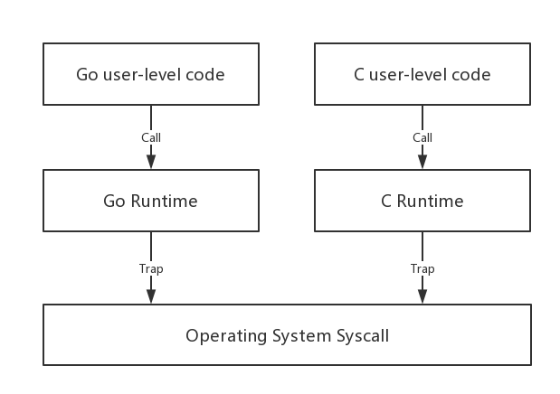

## 也谈Go的可移植性

Go有很多优点，比如：简单、原生支持并发等，而不错的可移植性也是Go被广大程序员接纳的重要因素之一。但你知道为什么Go语言拥有很好的平台可移植性吗？本着“知其然，亦要知其所以然”的精神，本文我们就来探究一下Go良好可移植性背后的原理。

### 一、Go的可移植性

说到一门编程语言可移植性，我们一般从下面两个方面考量：

- 语言自身被移植到不同平台的容易程度；
- 通过这种语言编译出来的应用程序对平台的适应性。

在Go 1.7及以后版本中，我们可以通过下面命令查看Go支持OS和平台列表：


``` 
$go tool dist list
android/386
android/amd64
android/arm
android/arm64
darwin/386
darwin/amd64
darwin/arm
darwin/arm64
dragonfly/amd64
freebsd/386
freebsd/amd64
freebsd/arm
linux/386
linux/amd64
linux/arm
linux/arm64
linux/mips
linux/mips64
linux/mips64le
linux/mipsle
linux/ppc64
linux/ppc64le
linux/s390x
nacl/386
nacl/amd64p32
nacl/arm
netbsd/386
netbsd/amd64
netbsd/arm
openbsd/386
openbsd/amd64
openbsd/arm
plan9/386
plan9/amd64
plan9/arm
solaris/amd64
windows/386
windows/amd64
从上述列表我们可以看
```

从上述列表我们可以看出：从linux/arm64的嵌入式系统到linux/s390x的大型机系统，再到Windows、linux和darwin(mac)这样的主流操作系统、amd64、386这样的主流处理器体系，Go对各种平台和操作系统的支持不可谓不广泛。

Go官方似乎没有给出明确的porting guide，关于将Go语言porting到其他平台上的内容更多是在golang-dev这样的小圈子中讨论的事情。但就Go语言这么短的时间就能很好的支持这么多平台来看，Go的porting还是相对easy的。从个人对Go的了解来看，这一定程度上得益于Go独立实现了runtime。



runtime是支撑程序运行的基础。我们最熟悉的莫过于libc（C运行时），它是目前主流操作系统上应用最普遍的运行时，通常以动态链接库的形式(比如：/lib/x86_64-linux-gnu/libc.so.6)随着系统一并发布，它的功能大致有如下几个：

- 提供基础库函数调用，比如：strncpy；
- 封装syscall（注:syscall是操作系统提供的API口，当用户层进行系统调用时，代码会trap(陷入)到内核层面执行），并提供同语言的库函数调用，比如：malloc、fread等；
- 提供程序启动入口函数，比如：linux下的__libc_start_main。

libc等c runtime lib是很早以前就已经实现的了，甚至有些老旧的libc还是单线程的。一些从事c/c++开发多年的程序员早年估计都有过这样的经历：那就是链接runtime库时甚至需要选择链接支持多线程的库还是只支持单线程的库。除此之外，c runtime的版本也参差不齐。这样的c runtime状况完全不能满足go语言自身的需求；另外Go的目标之一是原生支持并发，并使用goroutine模型，c runtime对此是无能为力的，因为c runtime本身是基于线程模型的。综合以上因素，Go自己实现了runtime，并封装了syscall，为不同平台上的go user level代码提供封装完成的、统一的go标准库；同时Go runtime实现了对goroutine模型的支持。

独立实现的go runtime层将Go user-level code与OS syscall解耦，把Go porting到一个新平台时，将runtime与新平台的syscall对接即可(当然porting工作不仅仅只有这些)；同时，runtime层的实现基本摆脱了Go程序对libc的依赖，这样静态编译的Go程序具有很好的平台适应性。比如：一个compiled for linux amd64的Go程序可以很好的运行于不同linux发行版（centos、ubuntu）下。


    以下测试试验环境为:darwin amd64 Go 1.8。


### 二、默认”静态链接”的Go程序

我们先来写两个程序：hello.c和hello.go，它们完成的功能都差不多，在stdout上输出一行文字：

```go
//hello.c
#include <stdio.h>

int main() {
        printf("%s\n", "hello, portable c!");
        return 0;
}

//hello.go
package main

import "fmt"

func main() {
    fmt.Println("hello, portable go!")
}

```

我们采用“默认”方式分别编译以下两个程序：

```
$cc -o helloc hello.c
$go build -o hellogo hello.go

$ls -l
-rwxr-xr-x    1 tony  staff     8496  6 27 14:18 helloc*
-rwxr-xr-x    1 tony  staff  1628192  6 27 14:18 hellogo*
```

从编译后的两个文件helloc和hellogo的size上我们可以看到hellogo相比于helloc简直就是“巨人”般的存在，其size近helloc的200倍。略微学过一些Go的人都知道，这是因为hellogo中包含了必需的go runtime。我们通过otool工具(linux上可以用ldd)查看一下两个文件的对外部动态库的依赖情况：

```
$otool -L helloc
helloc:
    /usr/lib/libSystem.B.dylib (compatibility version 1.0.0, current version 1197.1.1)
$otool -L hellogo
hellogo:
```

通过otool输出，我们可以看到hellogo并不依赖任何外部库，我们将hellog这个二进制文件copy到任何一个mac amd64的平台上，均可以运行起来。而helloc则依赖外部的动态库:/usr/lib/libSystem.B.dylib，而libSystem.B.dylib这个动态库还有其他依赖。我们通过nm工具可以查看到helloc具体是哪个函数符号需要由外部动态库提供：

```
$nm helloc
0000000100000000 T __mh_execute_header
0000000100000f30 T _main
                 U _printf
                 U dyld_stub_binder
```

可以看到：_printf和dyld_stub_binder两个符号是未定义的(对应的前缀符号是U)。如果对hellog使用nm，你会看到大量符号输出，但没有未定义的符号。

```
$nm hellogo
00000000010bb278 s $f64.3eb0000000000000
00000000010bb280 s $f64.3fd0000000000000
00000000010bb288 s $f64.3fe0000000000000
00000000010bb290 s $f64.3fee666666666666
00000000010bb298 s $f64.3ff0000000000000
00000000010bb2a0 s $f64.4014000000000000
00000000010bb2a8 s $f64.4024000000000000
00000000010bb2b0 s $f64.403a000000000000
00000000010bb2b8 s $f64.4059000000000000
00000000010bb2c0 s $f64.43e0000000000000
00000000010bb2c8 s $f64.8000000000000000
00000000010bb2d0 s $f64.bfe62e42fefa39ef
000000000110af40 b __cgo_init
000000000110af48 b __cgo_notify_runtime_init_done
000000000110af50 b __cgo_thread_start
000000000104d1e0 t __rt0_amd64_darwin
000000000104a0f0 t _callRet
000000000104b580 t _gosave
000000000104d200 T _main
00000000010bbb20 s _masks
000000000104d370 t _nanotime
000000000104b7a0 t _setg_gcc
00000000010bbc20 s _shifts
0000000001051840 t errors.(*errorString).Error
00000000010517a0 t errors.New
.... ...
0000000001065160 t type..hash.time.Time
0000000001064f70 t type..hash.time.zone
00000000010650a0 t type..hash.time.zoneTrans
0000000001051860 t unicode/utf8.DecodeRuneInString
0000000001051a80 t unicode/utf8.EncodeRune
0000000001051bd0 t unicode/utf8.RuneCount
0000000001051d10 t unicode/utf8.RuneCountInString
0000000001107080 s unicode/utf8.acceptRanges
00000000011079e0 s unicode/utf8.first

$nm hellogo|grep " U "
```

Go将所有运行需要的函数代码都放到了hellogo中，这就是所谓的“静态链接”。是不是所有情况下，Go都不会依赖外部动态共享库呢？我们来看看下面这段代码：

```go
//server.go
package main

import (
    "log"
    "net/http"
    "os"
)

func main() {
    cwd, err := os.Getwd()
    if err != nil {
        log.Fatal(err)
    }

    srv := &http.Server{
        Addr:    ":8000", // Normally ":443"
        Handler: http.FileServer(http.Dir(cwd)),
    }
    log.Fatal(srv.ListenAndServe())
}

```

我们利用Go标准库的net/http包写了一个fileserver，我们build一下该server，并查看它是否有外部依赖以及未定义的符号：

```go
$go build server.go
-rwxr-xr-x    1 tony  staff  5943828  6 27 14:47 server*

$otool -L server
server:
    /usr/lib/libSystem.B.dylib (compatibility version 0.0.0, current version 0.0.0)
    /System/Library/Frameworks/CoreFoundation.framework/Versions/A/CoreFoundation (compatibility version 0.0.0, current version 0.0.0)
    /System/Library/Frameworks/Security.framework/Versions/A/Security (compatibility version 0.0.0, current version 0.0.0)
    /usr/lib/libSystem.B.dylib (compatibility version 0.0.0, current version 0.0.0)
    /usr/lib/libSystem.B.dylib (compatibility version 0.0.0, current version 0.0.0)

$nm server |grep " U "
                 U _CFArrayGetCount
                 U _CFArrayGetValueAtIndex
                 U _CFDataAppendBytes
                 U _CFDataCreateMutable
                 U _CFDataGetBytePtr
                 U _CFDataGetLength
                 U _CFDictionaryGetValueIfPresent
                 U _CFEqual
                 U _CFNumberGetValue
                 U _CFRelease
                 U _CFStringCreateWithCString
                 U _SecCertificateCopyNormalizedIssuerContent
                 U _SecCertificateCopyNormalizedSubjectContent
                 U _SecKeychainItemExport
                 U _SecTrustCopyAnchorCertificates
                 U _SecTrustSettingsCopyCertificates
                 U _SecTrustSettingsCopyTrustSettings
                 U ___error
                 U ___stack_chk_fail
                 U ___stack_chk_guard
                 U ___stderrp
                 U _abort
                 U _fprintf
                 U _fputc
                 U _free
                 U _freeaddrinfo
                 U _fwrite
                 U _gai_strerror
                 U _getaddrinfo
                 U _getnameinfo
                 U _kCFAllocatorDefault
                 U _malloc
                 U _memcmp
                 U _nanosleep
                 U _pthread_attr_destroy
                 U _pthread_attr_getstacksize
                 U _pthread_attr_init
                 U _pthread_cond_broadcast
                 U _pthread_cond_wait
                 U _pthread_create
                 U _pthread_key_create
                 U _pthread_key_delete
                 U _pthread_mutex_lock
                 U _pthread_mutex_unlock
                 U _pthread_setspecific
                 U _pthread_sigmask
                 U _setenv
                 U _strerror
                 U _sysctlbyname
                 U _unsetenv
```

通过otool和nm的输出结果我们惊讶的看到：默认采用“静态链接”的Go程序怎么也要依赖外部的动态链接库，并且也包含了许多“未定义”的符号了呢？问题在于cgo。

### 三、cgo对可移植性的影响

默认情况下，Go的runtime环境变量CGO_ENABLED=1，即默认开始cgo，允许你在Go代码中调用C代码，Go的pre-compiled标准库的.a文件也是在这种情况下编译出来的。在$GOROOT/pkg/darwin_amd64中，我们遍历所有预编译好的标准库.a文件，并用nm输出每个.a的未定义符号，我们看到下面一些包是对外部有依赖的（动态链接）：

``` 
=> crypto/x509.a
                 U _CFArrayGetCount
                 U _CFArrayGetValueAtIndex
                 U _CFDataAppendBytes
                 ... ...
                 U _SecCertificateCopyNormalizedIssuerContent
                 U _SecCertificateCopyNormalizedSubjectContent
                 ... ...
                 U ___stack_chk_fail
                 U ___stack_chk_guard
                 U __cgo_topofstack
                 U _kCFAllocatorDefault
                 U _memcmp
                 U _sysctlbyname

=> net.a
                 U ___error
                 U __cgo_topofstack
                 U _free
                 U _freeaddrinfo
                 U _gai_strerror
                 U _getaddrinfo
                 U _getnameinfo
                 U _malloc

=> os/user.a
                 U __cgo_topofstack
                 U _free
                 U _getgrgid_r
                 U _getgrnam_r
                 U _getgrouplist
                 U _getpwnam_r
                 U _getpwuid_r
                 U _malloc
                 U _realloc
                 U _sysconf

=> plugin.a
                 U __cgo_topofstack
                 U _dlerror
                 U _dlopen
                 U _dlsym
                 U _free
                 U _malloc
                 U _realpath$DARWIN_EXTSN

=> runtime/cgo.a
                 ... ...
                 U _abort
                 U _fprintf
                 U _fputc
                 U _free
                 U _fwrite
                 U _malloc
                 U _nanosleep
                 U _pthread_attr_destroy
                 U _pthread_attr_getstacksize
                 ... ...
                 U _setenv
                 U _strerror
                 U _unsetenv

=> runtime/race.a
                 U _OSSpinLockLock
                 U _OSSpinLockUnlock
                 U __NSGetArgv
                 U __NSGetEnviron
                 U __NSGetExecutablePath
                 U ___error
                 U ___fork
                 U ___mmap
                 U ___munmap
                 U ___stack_chk_fail
                 U ___stack_chk_guard
                 U __dyld_get_image_header
                .... ...
```

我们以os/user为例，在CGO_ENABLED=1，即cgo开启的情况下，os/user包中的lookupUserxxx系列函数采用了c版本的实现，我们看到在$GOROOT/src/os/user/lookup_unix.go中的build tag中包含了+build cgo。这样一来，在CGO_ENABLED=1，该文件将被编译，该文件中的c版本实现的lookupUser将被使用：

```
// +build darwin dragonfly freebsd !android,linux netbsd openbsd solaris
// +build cgo

package user
... ...
func lookupUser(username string) (*User, error) {
    var pwd C.struct_passwd
    var result *C.struct_passwd
    nameC := C.CString(username)
    defer C.free(unsafe.Pointer(nameC))
    ... ...
}
```

这样来看，凡是依赖上述包的Go代码最终编译的可执行文件都是要有外部依赖的。不过我们依然可以通过disable CGO_ENABLED来编译出纯静态的Go程序：

```
$CGO_ENABLED=0 go build -o server_cgo_disabled server.go

$otool -L server_cgo_disabled
server_cgo_disabled:
$nm server_cgo_disabled |grep " U "
```

如果你使用build的 “-x -v”选项，你将看到go compiler会重新编译依赖的包的静态版本，包括net、mime/multipart、crypto/tls等，并将编译后的.a(以包为单位)放入临时编译器工作目录($WORK)下，然后再静态连接这些版本。

### 四、internal linking和external linking

问题来了：在CGO_ENABLED=1这个默认值的情况下，是否可以实现纯静态连接呢？答案是可以。在$GOROOT/cmd/cgo/doc.go中，文档介绍了cmd/link的两种工作模式：internal linking和external linking。

#### 1、internal linking

internal linking的大致意思是若用户代码中仅仅使用了net、os/user等几个标准库中的依赖cgo的包时，cmd/link默认使用internal linking，而无需启动外部external linker(如:gcc、clang等)，不过由于cmd/link功能有限，仅仅是将.o和pre-compiled的标准库的.a写到最终二进制文件中。因此如果标准库中是在CGO_ENABLED=1情况下编译的，那么编译出来的最终二进制文件依旧是动态链接的，即便在go build时传入-ldflags ‘extldflags “-static”‘亦无用，因为根本没有使用external linker：

``` 
$go build -o server-fake-static-link  -ldflags '-extldflags "-static"' server.go
$otool -L server-fake-static-link
server-fake-static-link:
    /usr/lib/libSystem.B.dylib (compatibility version 0.0.0, current version 0.0.0)
    /System/Library/Frameworks/CoreFoundation.framework/Versions/A/CoreFoundation (compatibility version 0.0.0, current version 0.0.0)
    /System/Library/Frameworks/Security.framework/Versions/A/Security (compatibility version 0.0.0, current version 0.0.0)
    /usr/lib/libSystem.B.dylib (compatibility version 0.0.0, current version 0.0.0)
    /usr/lib/libSystem.B.dylib (compatibility version 0.0.0, current version 0.0.0)
```

#### 2、external linking

而external linking机制则是cmd/link将所有生成的.o都打到一个.o文件中，再将其交给外部的链接器，比如gcc或clang去做最终链接处理。如果此时，我们在cmd/link的参数中传入-ldflags ‘extldflags “-static”‘，那么gcc/clang将会去做静态链接，将.o中undefined的符号都替换为真正的代码。我们可以通过-linkmode=external来强制cmd/link采用external linker，还是以server.go的编译为例：

```
$go build -o server-static-link  -ldflags '-linkmode "external" -extldflags "-static"' server.go
# command-line-arguments
/Users/tony/.bin/go18/pkg/tool/darwin_amd64/link: running clang failed: exit status 1
ld: library not found for -lcrt0.o
clang: error: linker command failed with exit code 1 (use -v to see invocation) 
```

可以看到，cmd/link调用的clang尝试去静态连接libc的.a文件，但由于我的mac上仅仅有libc的dylib，而没有.a，因此静态连接失败。我找到一个ubuntu 16.04环境：重新执行上述构建命令：

```
# go build -o server-static-link  -ldflags '-linkmode "external" -extldflags "-static"' server.go
# ldd server-static-link
    not a dynamic executable
# nm server-static-link|grep " U "
```

该环境下libc.a和libpthread.a分别在下面两个位置：

```
/usr/lib/x86_64-linux-gnu/libc.a
/usr/lib/x86_64-linux-gnu/libpthread.a
```

就这样，我们在CGO_ENABLED=1的情况下，也编译构建出了一个纯静态链接的Go程序。

如果你的代码中使用了C代码，并依赖cgo在go中调用这些c代码，那么cmd/link将会自动选择external linking的机制：

```go
//testcgo.go
package main

//#include <stdio.h>
// void foo(char *s) {
//    printf("%s\n", s);
// }
// void bar(void *p) {
//    int *q = (int*)p;
//    printf("%d\n", *q);
// }
import "C"
import (
    "fmt"
    "unsafe"
)

func main() {
    var s = "hello"
    C.foo(C.CString(s))

    var i int = 5
    C.bar(unsafe.Pointer(&i))

    var i32 int32 = 7
    var p *uint32 = (*uint32)(unsafe.Pointer(&i32))
    fmt.Println(*p)
}
```

编译testcgo.go：

```
# go build -o testcgo-static-link  -ldflags '-extldflags "-static"' testcgo.go
# ldd testcgo-static-link
    not a dynamic executable
```

vs.

```
# go build -o testcgo testcgo.go
# ldd ./testcgo
    linux-vdso.so.1 =>  (0x00007ffe7fb8d000)
    libpthread.so.0 => /lib/x86_64-linux-gnu/libpthread.so.0 (0x00007fc361000000)
    libc.so.6 => /lib/x86_64-linux-gnu/libc.so.6 (0x00007fc360c36000)
    /lib64/ld-linux-x86-64.so.2 (0x000055bd26d4d000)
```

### 五、小结

本文探讨了Go的可移植性以及哪些因素对Go编译出的程序的移植性有影响：

- 你的程序用了哪些标准库包？如果仅仅是非net、os/user等的普通包，那么你的程序默认将是纯静态的，不依赖任何c lib等外部动态链接库；
- 如果使用了net这样的包含cgo代码的标准库包，那么CGO_ENABLED的值将影响你的程序编译后的属性：是静态的还是动态链接的；
- CGO_ENABLED=0的情况下，Go采用纯静态编译；
- 如果CGO_ENABLED=1，但依然要强制静态编译，需传递-linkmode=external给cmd/link。


    作者：bigwhite
    链接：https://tonybai.com/2017/06/27/an-intro-about-go-portability/
    著作权归作者所有。商业转载请联系作者获得授权，非商业转载请注明出处。